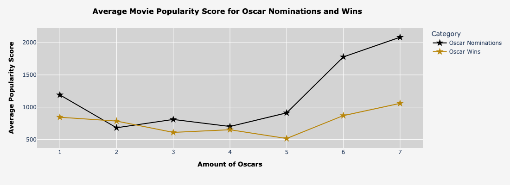

# imdb_webscraper
Team Monty's Data Circus explores the Top 250 Movies on IMDb

## Overview
This project extracts movie and actor data from IMDb’s Top 250 Movies list using Selenium and BeautifulSoup and includes an exploratory data analysis (EDA) notebook for visualizing trends. It consists of three main components:

1. Movie Scraper

- Uses Selenium and BeautifulSoup to fetch the IMDb Top 250 list.
- Extracts additional details from each movie's page with BeautifulSoup.
- Saves the data in a structured dataset.

2. Actor Scraper

- Uses BeautifulSoup to gather details about actors featured in these top movies.
- References the dataset created by the Movie Scraper to identify key actors.
- Saves actor data in a separate dataset.

3. Data Analysis & Visualization

- Data analysis uses the scraped movie dataset.
- Performs exploratory data analysis (EDA) to identify patterns and trends.
- Creates visualizations to better understand IMDb’s top movies and key actors.

4. Notebooks
   
- `Movies_IMDb_Scraper.ipynb` - Scrapes IMDb's Top 250 Movies list and the movie pages. It saves the dataset as `top_movies.csv`.
- `Actors_IMDb_Scraper.ipynb` - Extracts actor details from the `movie_details_8FEB.csv` and saves them as `top_actors.csv`
- `IMDb_TopMovies_EDA.ipynb` - Loads the `movie_details_8FEB.csv` to explore trends, perform EDA, and create visualizations that answer several questions our team had about the data. 

4. Datasets

- All datasets are stored in the `notebooks/datasets` directory.
- `movie_details_8FEB.csv` – This dataset is used in the Data Analysis notebook for exploring trends and visualizing insights.
- `top_movies.csv` – Created by the Movie Scraper, containing details about IMDb’s Top 250 Movies.
- `top_actors.csv` - Created by the Actor Scraper, listing key actors from the movies dataset.

## Features

- Automated scraping of IMDb’s Top 250 Movies.
- Uses Selenium for navigating dynamic content.
- Extracts movie and actor details efficiently with BeautifulSoup.
- Saves data as CSV files for further analysis.
- Performs data visualization and statistical analysis on scraped data.

## Tech Stack

- Python
- Jupyter Notebooks
- Selenium (for scraping the Top 250 page)
- BeautifulSoup (for parsing movie and actor details)
- Pandas, Matplotlib, Plotly Express (for data analysis and visualization)
  
